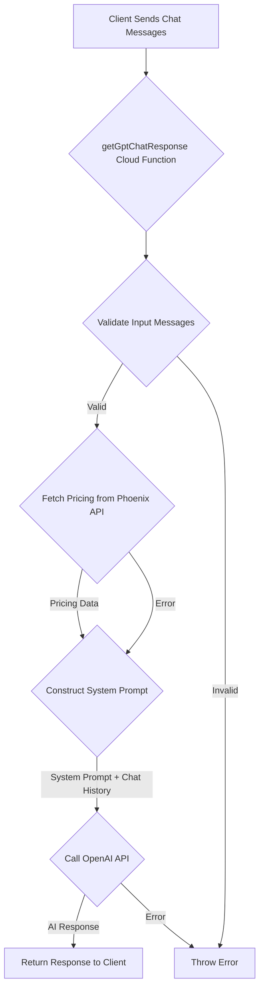

# Chatbot Documentation: `getGptChatResponse.ts`

This Firebase Callable Function serves as the backend for a chatbot, "RescueBot," designed to assist users by interacting with an OpenAI GPT model. Its primary purpose is to guide users through a structured conversation to gather information for roadside assistance and provide pricing details.

## Core Functionality

1.  **Receives Chat History:** The function accepts an array of chat messages representing the conversation history between the user and the assistant.
2.  **Dynamic Pricing Integration:** It fetches real-time service pricing information from an external "Phoenix API." This pricing data is then incorporated into the instructions given to the AI.
3.  **System Prompt Engineering:** A detailed system prompt is constructed. This prompt defines:
    *   **Persona:** "RescueBot," a friendly AI assistant for Rescue Rob's Roadside Services.
    *   **Objective:** Help stranded motorists by collecting necessary information (name, phone, location, vehicle details, service needed, preferred time).
    *   **Conversation Flow:** A 10-step structured conversation guide.
    *   **Pricing Guidelines:** Strict rules on how to present the fetched pricing information, emphasizing transparency and using only the official data.
    *   **Service Catalog:** A specific list of services and their IDs that the AI should try to match.
4.  **OpenAI Interaction:** It sends the system prompt and the conversation history to an OpenAI GPT model. It can use either:
    *   A fine-tuned model: `ft:gpt-4o-mini-2024-07-18:rescue-robs-roadside::BU1LpSKu` (default if `useFineTuned` is true).
    *   A standard model: `gpt-4o-mini`.
5.  **Returns AI Response:** The function processes the OpenAI API's response and sends the AI-generated message back to the client application.

## How It Works (Key Steps)

1.  **Input Processing:**
    *   The function is triggered by a client calling it with a payload (`RequestData`) containing:
        *   `messages`: An array of `ChatMessage` objects (roles: 'system', 'user', 'assistant').
        *   `maxTokens` (optional, default: 300): Maximum tokens for the AI's response.
        *   `useFineTuned` (optional, default: true): Boolean to select the model.
        *   `debugMode` (optional, default: false): For verbose logging.
    *   It validates that the `messages` array is present and not empty.

2.  **Environment Configuration:**
    *   Relies on environment variables:
        *   `OPENAI_API_KEY` (or `RESCUE_LINK_OPENAI_API` as a fallback): For authenticating with OpenAI.
        *   `PHOENIX_API_URL`: The base URL for the external Phoenix API that provides service pricing.

3.  **Fetching Service Pricing (`fetchServicesPricingFromPhoenix`):**
    *   This asynchronous helper function queries the `PHOENIX_API_URL/services` endpoint.
    *   It first attempts to determine the total number of services to fetch all of them in a single subsequent request.
    *   It filters the fetched services:
        *   Includes services explicitly listed in `targetServiceIds` (e.g., 1, 3, 4, 5, 6, 11, 12, 14, 16, 19, 24, 25, 27, 32).
        *   Includes any service where `isInternal === false`.
    *   It formats the pricing information into a string. This involves:
        *   **Hardcoded Overrides:** Specific formatting for certain service IDs (e.g., ID 1: Automotive Unlocking, ID 3: Jump Start, ID 4: Flat Tire Changing, ID 11: Towing, ID 12: Car Battery Installation, ID 14: Fuel Delivery). For example, Automotive Unlocking is formatted as "$65-$125 depending on vehicle type and key complexity."
        *   **General Logic:** For other services, it converts price from cents to dollars, or uses the service description if the price is zero or indicates variability.
    *   If the Phoenix API call fails or returns no services, it provides a fallback message.

4.  **System Prompt Construction (`systemPromptContent`):**
    *   The dynamically fetched and formatted `servicesPricing` string is embedded directly into the system prompt.
    *   The prompt instructs the AI ("RescueBot") on its conversational duties, including the 10-step information gathering process, how to handle pricing inquiries (using only the provided data), and a list of specific services with IDs to recognize.

5.  **OpenAI API Call:**
    *   The function prepends the `systemMessage` to the user's `messages` if a system message isn't already the first message.
    *   It makes a POST request to `https://api.openai.com/v1/chat/completions` using `node-fetch`.
    *   The request body includes the chosen `model` ID, the `completeMessages` array, `max_tokens`, and a fixed `temperature` of 0.7.

6.  **Response Handling:**
    *   If the OpenAI API call is successful, it extracts the AI's message content from the response.
    *   It returns an object to the client containing:
        *   `message`: The AI's text response.
        *   `model`: The ID of the OpenAI model used.
        *   `request_id`: The ID of the OpenAI request.
        *   `finish_reason`: The reason OpenAI stopped generating tokens (e.g., "stop", "length").

7.  **Error Handling:**
    *   The function includes `try-catch` blocks to handle errors during input validation, API calls (Phoenix and OpenAI), or other processing.
    *   Errors are thrown as `functions.https.HttpsError`, providing structured error information to the client.

## Capabilities

*   **Conversational AI:** Engages users in a seemingly natural conversation.
*   **Structured Information Gathering:** Programmed to follow a specific flow to collect essential details for roadside assistance.
*   **Dynamic Pricing:** Can provide up-to-date (based on Phoenix API) pricing information for various services.
*   **Persona-Driven Interaction:** Adopts the "RescueBot" persona as defined in the system prompt.
*   **Model Selection:** Allows choosing between a fine-tuned GPT model (potentially optimized for this specific task) and a standard GPT model.
*   **Debugging Support:** Includes a `debugMode` for more detailed server-side logging.

## Limitations

*   **No Actual Service Dispatch:** The chatbot only gathers information and confirms it *would* submit a request. It does **not** actually dispatch any services or integrate with a backend dispatch system. The prompt explicitly states: "You will not actually submit, just confirm you would."
*   **Dependency on Phoenix API:** The accuracy and availability of pricing information are entirely dependent on the external Phoenix API. If this API is down, changes its response format, or provides incorrect data, the chatbot's pricing information will be affected.
*   **Hardcoded Pricing Logic:** The formatting of pricing for several specific services (IDs 1, 3, 4, 11, 12, 14) and the list of `targetServiceIds` are hardcoded within the `fetchServicesPricingFromPhoenix` function. Changes to these services, their pricing structures, or the desired presentation would require code modifications.
*   **Adherence to Prompt:** While the system prompt is detailed, the AI's adherence to the structured conversation and guidelines is not guaranteed and depends on OpenAI's model behavior.
*   **Static Service List in Prompt:** The list of services and their IDs in the system prompt (`systemPromptContent`) is static. If the Phoenix API offers new services not listed here, the AI might not recognize them or categorize them as "Other (ID: 35)".
*   **No Long-Term Memory:** Like standard GPT models, it has no memory of past conversations beyond the `messages` array provided in each call.
*   **Captcha Deferred:** The code includes a commented-out `captchaToken` field, indicating that CAPTCHA validation for abuse prevention is planned but not currently implemented.
*   **API Key Security:** Relies on environment variables for API keys, which is standard practice but requires proper configuration and security management in the Firebase environment.
*   **Fine-Tuned Model Maintenance:** The effectiveness of the fine-tuned model (`ft:gpt-4o-mini-2024-07-18:rescue-robs-roadside::BU1LpSKu`) depends on the quality of its training data and may require periodic retraining or updates.