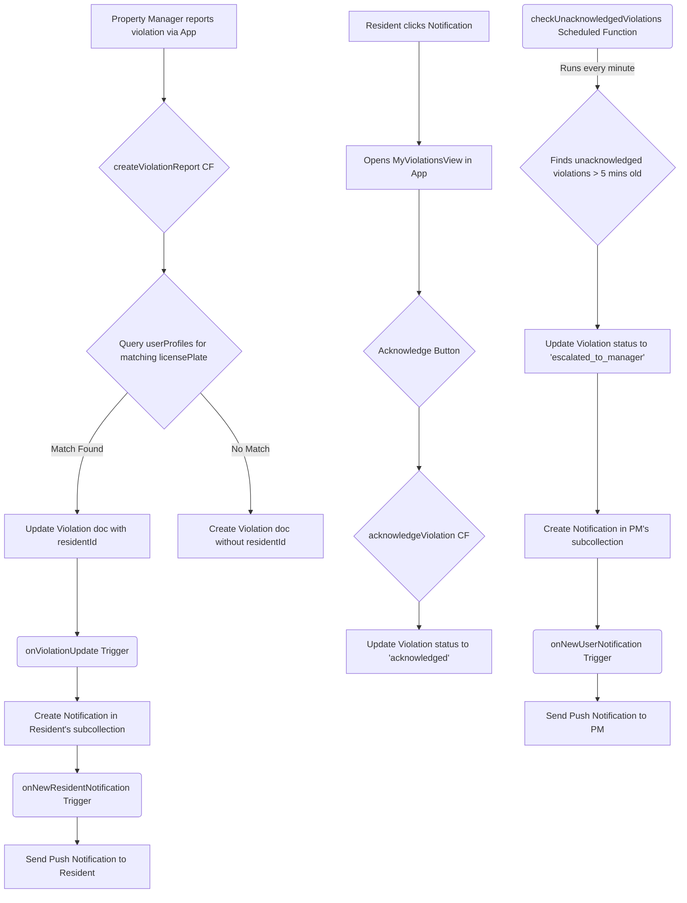

# Violation and Notification System Documentation

This document outlines the architecture and workflow of the parking violation reporting and resident notification system.

## 1. System Goal

The primary goal is to allow property managers to report parking violations and, if the vehicle belongs to a registered resident, automatically notify that resident. The system includes an initial notification, an acknowledgement mechanism for the resident, and an escalation process if the notification is ignored.

## 2. High-Level Workflow



## 3. Backend Components

### Callable Functions

-   **`createViolationReport`**:
    -   Triggered when a property manager submits a violation report.
    -   It takes violation details (`organizationId`, `propertyId`, `licensePlate`, etc.).
    -   It queries the `userProfiles` collection within the organization for a vehicle with a matching `licensePlate`.
    -   If a match is found, it creates a `violation` document with the matched `residentId` and a status of `pending_acknowledgement`.
    -   If no match is found, the `residentId` is `null` and the status is `reported`.
    -   Violations are stored at `organizations/{orgId}/violations/{violationId}`.

-   **`acknowledgeViolation`**:
    -   Called by a resident from the frontend.
    -   Takes `violationId` and `organizationId`.
    -   Verifies that the caller is the resident assigned to the violation.
    -   Updates the violation's status to `acknowledged`.

-   **`getViolationDetails`**:
    -   Called by the frontend to fetch data for a single violation.
    -   Takes `violationId` and `organizationId`.
    -   Verifies that the caller is either the resident assigned to the violation or the property manager who reported it.
    -   Returns the full violation document.

### Firestore Triggers

-   **`onViolationUpdate`**:
    -   Fires when a document in `organizations/{orgId}/violations` is updated.
    -   Specifically, it checks if a `residentId` was just added.
    -   If so, it creates a notification document in the resident's notification subcollection: `organizations/{orgId}/properties/{propId}/residents/{residentId}/notifications`.

-   **`onNewAdminNotification` / `onNewUserNotification` / `onNewResidentNotification`**:
    -   These three triggers listen for new documents in the respective role-specific notification subcollections.
    -   When a new notification document is created, the appropriate trigger fires.
    -   It fetches the user's FCM tokens from their profile (`admins/{id}`, `organizations/{orgId}/userProfiles/{id}`).
    -   It sends a push notification to the user's registered devices via Firebase Cloud Messaging.
    -   It handles cleanup of stale/invalid FCM tokens.

### Scheduled Functions

-   **`checkUnacknowledgedViolations`**:
    -   Runs every minute via a Pub/Sub schedule.
    -   Queries for all violations across all organizations with a status of `pending_acknowledgement` that were created more than 5 minutes ago.
    -   For each found violation, it:
        1.  Updates the violation's status to `escalated_to_manager`.
        2.  Creates a notification in the subcollection of the property manager who originally reported the violation (`organizations/{orgId}/users/{reporterId}/notifications`).

## 4. Frontend Components

-   **`Notifications.tsx`**:
    -   A global component, typically in the `AppBar`.
    -   Listens in real-time to the current user's notification subcollection based on their role.
    -   Displays a badge with the count of unread notifications.
    -   Shows a dropdown list of recent notifications.
    -   Clicking a notification navigates the user to the `link` provided in the notification data.

-   **`MyViolationsView.tsx`**:
    -   A view for residents, typically found at `/dashboard/resident/my-violations` and `/dashboard/resident/violations/:violationId`.
    -   When navigated to with a `violationId`, it calls the `getViolationDetails` function to fetch the violation data.
    -   It displays the violation details, including the photo.
    -   If the violation status is `pending_acknowledgement`, it displays an "I'm Moving It" button.
    -   Clicking the button calls the `acknowledgeViolation` function and updates the UI to reflect the new "acknowledged" status.

## 5. Data Structures

-   **Violations**: Stored at `organizations/{orgId}/violations/{violationId}`.
    ```json
    {
      "licensePlate": "ABC-123",
      "violationType": "Unauthorized Parking",
      "photoUrl": "https://firebasestorage.googleapis.com/...",
      "reporterId": "pm_user_uid",
      "residentId": "resident_user_uid", // or null
      "propertyId": "property_abc",
      "organizationId": "org_xyz",
      "status": "pending_acknowledgement", // or 'acknowledged', 'escalated_to_manager', 'reported'
      "createdAt": "...",
      "acknowledgedAt": "..." // optional
    }
    ```

-   **Notifications**: Stored in role-specific subcollections (e.g., `organizations/{orgId}/properties/{propId}/residents/{residentId}/notifications/{notificationId}`).
    ```json
    {
      "title": "Parking Violation Warning",
      "body": "Your vehicle is in a restricted area...",
      "link": "/violations/the_violation_id",
      "createdAt": "...",
      "read": false
    }
    ```

This document provides a comprehensive overview of the violation and notification system's functionality and technical implementation.
