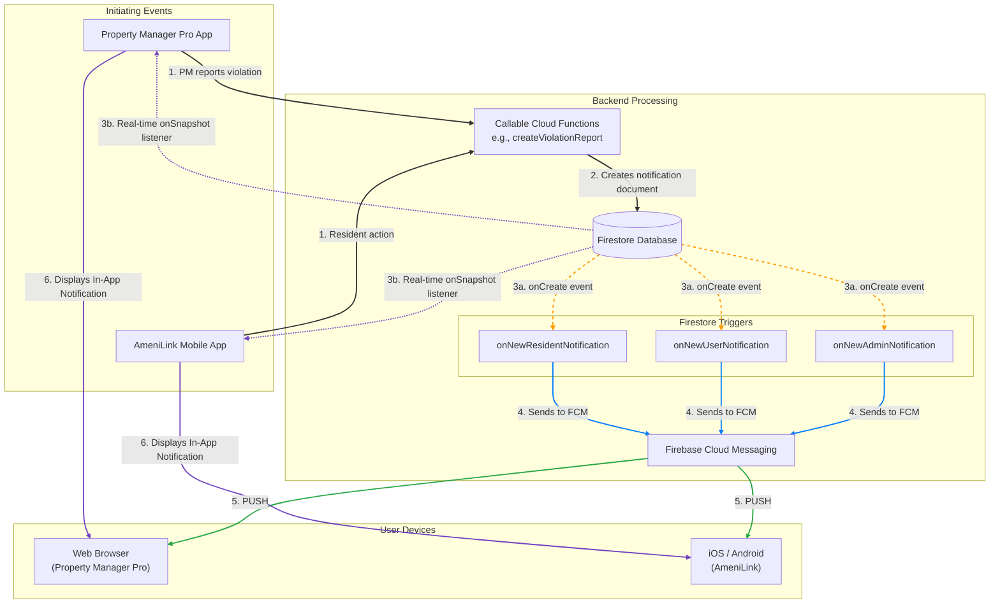

# Notification System Overview

This document provides a comprehensive overview of the notification architecture for both the **Property Manager Pro** web application and the **AmeniLink** mobile app. The system is designed to deliver timely and relevant notifications, both in-app and via push, to users based on their specific roles.

## 1. Core Architecture: Firestore-Driven Triggers

The entire notification system is orchestrated by Firestore. The core principle is that **creating a document in a user's specific `notifications` subcollection is the event that triggers all notification deliveries.**

This single action initiates two parallel processes:

1.  **In-App Notification:** The frontend applications (Property Manager Pro and AmeniLink) have real-time listeners attached to the current user's notification subcollection. When a new document is added, the UI updates instantly, typically showing a badge or a new item in a notification list.
2.  **Push Notification:** A set of Firestore `onCreate` Cloud Function triggers immediately fire when a new document is created. These backend functions are responsible for fetching the user's FCM (Firebase Cloud Messaging) tokens and sending a push notification to their registered devices (web or mobile).

This "write-once, deliver-twice" model ensures consistency and simplifies the logic for any part of the system that needs to send a notification.

## 2. Role-Based Notification Paths

To ensure notifications are delivered only to the correct user, the system uses a strict, role-based hierarchy for Firestore paths.

| User Role              | Firestore Notification Path                                                                 | Backend Trigger Fired         |
| ---------------------- | ------------------------------------------------------------------------------------------- | ----------------------------- |
| **Admin**              | `admins/{userId}/notifications/{notificationId}`                                            | `onNewAdminNotification`      |
| **Organization Manager** | `admins/{userId}/notifications/{notificationId}`                                            | `onNewAdminNotification`      |
| **Property Manager**   | `organizations/{organizationId}/users/{userId}/notifications/{notificationId}`              | `onNewUserNotification`       |
| **Resident**           | `organizations/{organizationId}/properties/{propertyId}/residents/{residentId}/notifications/{notificationId}` | `onNewResidentNotification`   |

**Key Architectural Points:**
*   **Admins and Organization Managers** are treated similarly at the top level. Their user profiles and notifications are stored in the root `admins` collection.
*   **Property Managers** are users scoped to a specific organization, so their notifications reside within that organization's `users` subcollection.
*   **Residents** are scoped to a specific property within an organization, leading to the most deeply nested notification path.

## 3. System Workflow Diagram

This diagram illustrates the complete flow, from an initiating event to the final delivery of notifications to both the web and mobile applications.

## 4. Use Case Example: Violation Reporting

The parking violation system is a perfect example of this architecture in action.

1.  **Report Creation:** A Property Manager uses the **Property Manager Pro** app to submit a violation report. This calls the `createViolationReport` Cloud Function.
2.  **Resident Identification:** The function searches for a resident vehicle matching the license plate. If a match is found, it creates the violation document and adds the `residentId`.
3.  **Initial Notification to Resident:** The `onViolationUpdate` trigger (not shown in the main diagram for simplicity, but part of the violation system) sees the `residentId` has been added and creates a notification document in the resident's notification path: `.../residents/{residentId}/notifications/{notificationId}`.
4.  **Delivery to Resident:**
    *   **Push:** The `onNewResidentNotification` trigger fires and sends an FCM push notification to the resident's **AmeniLink** app.
    *   **In-App:** The resident's **AmeniLink** app, listening to that path, shows a new notification.
5.  **Escalation:** If the resident does not acknowledge the violation within a set time (e.g., 5 minutes), a scheduled function (`checkUnacknowledgedViolations`) runs.
6.  **Notification to Property Manager:** This scheduled function updates the violation's status to `escalated` and creates a new notification document in the *Property Manager's* notification path: `.../users/{pm_userId}/notifications/{notificationId}`.
7.  **Delivery to Property Manager:**
    *   **Push:** The `onNewUserNotification` trigger fires, sending an FCM push to the PM's devices (web and/or mobile).
    *   **In-App:** The PM's **Property Manager Pro** app shows the new "Violation Escalated" notification.

This entire workflow is automated and relies on the foundational principle of creating notification documents in the correct, role-specific Firestore paths.
